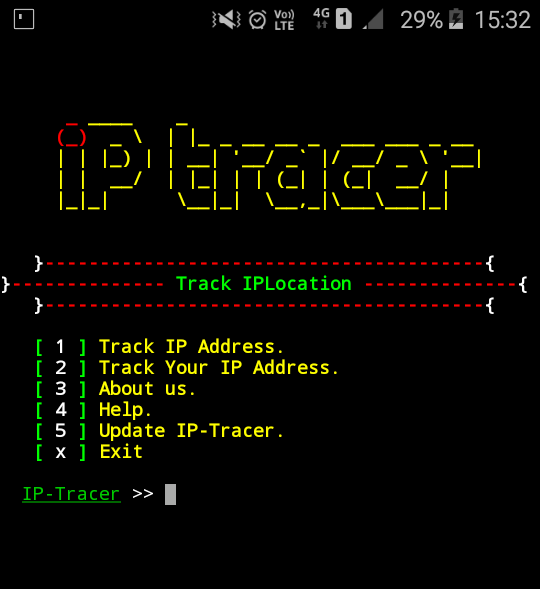
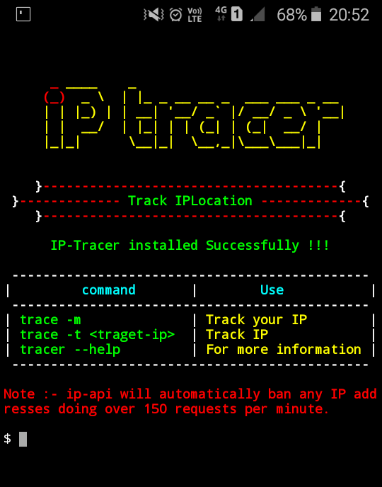

## F-IP-Checker

F-IP-Checker is used to track an ip address. F-IP-Checker is developed for Termux and Linux based systems. you can easily retrieve ip address information using F-IP-Checker. F-IP-Checker use ip-api to track ip address.

## How to install F-IP-Checker ?

* `apt update`

* `apt install git -y`

* `git clone https://github.com/SURJO99exe/location.git`

* `cd location/F-IP-Checker`

* `chmod +x install`

* `sh install` or `./install`

## How to use F-IP-Checker

* `trace -m` to track your own ip address.

* `trace -t target-ip` to track other's ip address for example `f-ip-checker -t 127.0.0.1`

* `trace` for more information.

**OR**

* `f-ip-checker -m` to track your own ip address.

* `f-ip-checker -t target-ip` to track other's ip address for example `f-ip-checker -t 127.0.0.1`

* `f-ip-checker` for more information.

**This project is not actively maintained.**
